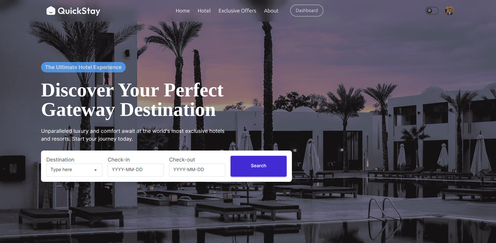

# QuickStay 🏨

> Discover and book luxury hotels and exclusive stays worldwide with a modern, responsive web app.

---

## 🌟 Overview

QuickStay is a premium hotel booking platform built with React, Vite and TailwindCSS. Users can browse featured destinations, view exclusive offers, read guest reviews, and book rooms with seamless date selection and filtering. The app features user authentication via Clerk and a beautiful, intuitive UI.

---

## ✨ Features

- Browse and search luxury hotels and destinations
- Filter rooms by type, price, and amenities
- View exclusive offers and special packages
- Read real guest reviews and ratings
- Detailed room and hotel information
- Responsive design for all devices
- User authentication and booking dashboard

---

## 🛠️ Tech Stack

- **Frontend:** React, Vite, TailwindCSS, DaisyUI
- **Routing:** React Router
- **Authentication:** Clerk
- **Icons & UI:** React Icons

---

## 🚀 Getting Started

1. **Clone the repository**
	```bash
	git clone https://github.com/Al-mizan/QuickStay.git
	cd QuickStay/client
	```

2. **Install dependencies**
	```bash
	npm install
	```

3. **Set up environment variables**
	- Copy `.env.example` to `.env` and add your Clerk publishable key.

4. **Run the development server**
	```bash
	npm run dev
	```

5. **Open in browser**
	- Visit [http://localhost:5173](http://localhost:5173)

---

## 📸 Screenshots



---

## 📂 Project Structure

```
client/
  ├── public/
  ├── src/
  │   ├── assets/
  │   ├── components/
  │   ├── pages/
  │   ├── App.jsx
  │   └── main.jsx
  ├── index.html
  ├── package.json
  └── vite.config.js
```

---

## 🙌 Contributing

Contributions are welcome! Please open issues or submit pull requests for improvements and new features.

---

## 📄 License

This project is licensed under the Apache License.
